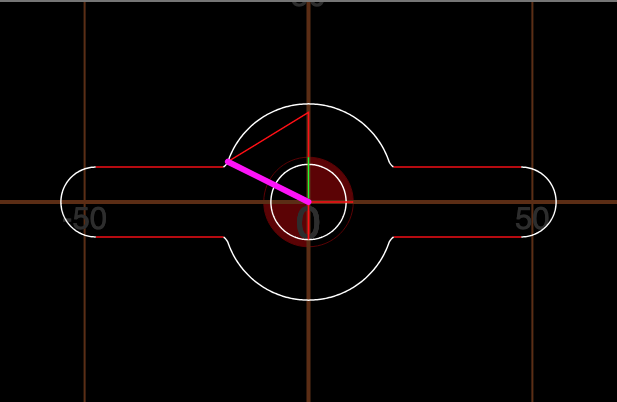
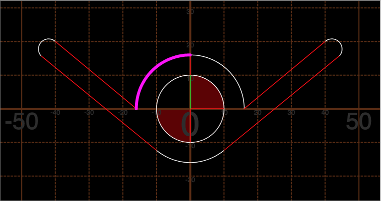
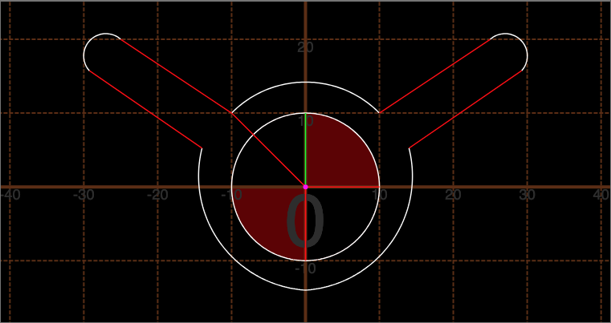

Every reader has their own preference for holding a book. Some like to read with both pages fully open, at about 180 degrees from left to right page. Others like to read their book at a 90 degree angle from left to right page, tilting the book from one side to the next. Below are gcode templates to try and map what those patterns would look like

## 180 degree Book Holder

Below is the basic pattern to drill a book holder for the thumb.

```gcode
G0 X0 Y0 Z0.5 

G0 X0 Y-10.0 Z0.5
G0 Z-0.5
(bore the thumbhole)
G2 X0 Y-10 Z-0.5 I0 J10.0


(Return to the center)
G0 Z0.5
G0 X0 Y0 Z0.5 

(Go and cut the outside shape)
G0 X-15.0 Y5.0 Z0.5 
G0 Z-0.5
G2 X15.0 Y5.0 Z-0.5 R17.5
G3 X17.5 Y3.0 Z-0.5 R3.5
G0 X47.5 Y3.0 Z-0.5
G2 X47.5 Y-3.0 Z-0.5 R3.0
G0 X17.5 Y-3.0 Z-0.5
G3 X15.0 Y-5.0 Z-0.5 R3.5
G2 X-15.0 Y-5.0 Z-0.5 R17.5
G3 X-17.5 Y-3.0 Z-0.5 R3.5
G0 X-47.5 Y-3.0 Z-0.5
G2 X-47.5 Y3.0 Z-0.5 R3.0
G0 X-17.5 Y3.0 Z-0.5
G3 X-15.0 Y5.0 Z-0.5 R3.5
```


### Enlarged for larger mill bits

In my case my smallest drill bit is a `1/8x1/6x3/8x1-1/2`. The diameter of the bit is 1/8, half of that is 1/16 or 1.5875mm. Increasing the measurements by 2.0 adds enough spacing and increases the bulkiness of the output, which in this case is desired.

```gcode
G0 Z0.5
G0 X0 Y0 Z0.5
G1 Z0.5 F800

G0 X0 Y-8.4 Z0.5
G0 Z-0.5

(bore the thumbhole)
G2 X0 Y-8.4 Z-0.5 I0 J8.4

(Return to the center)
G0 Z0.5
G0 X0.0 Y20.0 Z0.5 

(Go and cut the outside shape)
G0 X-18.0 Y9.0 Z0.5 
G0 Z-0.5
G2 X18.0 Y9.0 Z-0.5 R19
G3 X19 Y7.8 Z-0.5 R3.5
G0 X47.5 Y7.8 Z-0.5
G2 X47.5 Y-7.8 Z-0.5 R7.8
G0 X19 Y-7.8 Z-0.5
G3 X18.0 Y-9.0 Z-0.5 R3.5
G2 X-18.0 Y-9.0 Z-0.5 R19
G3 X-19 Y-7.8 Z-0.5 R3.5
G0 X-47.5 Y-7.8 Z-0.5
G2 X-47.5 Y7.8 Z-0.5 R7.8
G0 X-19 Y7.8 Z-0.5
G3 X-18.0 Y9.0 Z-0.5 R3.5


(Return to Center)
G0 Z0.5 
G0 X0 Y0 Z0.5 
```



## 90 degree book holder

Below is the basic pattern to drill a book holder for the thumb.

```gcode
G0 X0 Y0 Z0.5 

G0 X0 Y-10.0 Z0.5
G0 Z-0.5
(bore the thumbhole)
G2 X0 Y-10 Z-0.5 I0 J10.0


(Return to the center)
G0 Z0.5
G0 X0 Y0 Z0.5 

(Go and cut the outside shape)
G0 X0.0 Y16.0 Z0.5 
G0 Z-0.5
G2 X16.0 Y0.0 Z-0.5 R16
G0 X40.0 Y20.0 Z-0.5
G2 X44.25 Y15.75 Z-0.5 R3.01
G0 X10.0 Y-12.37 Z-0.5
G2 X0.0 Y-16.0 Z-0.5 R16
G2 X-10.0 Y-12.37 Z-0.5 R16
G0 X-44.25 Y15.75 Z-0.5
G2 X-40.0 Y20.0 Z-0.5 R3.01
G0 X-16.0 Y0.0 Z-0.5
G2 X0.0 Y16.0 Z-0.5 R16
```



## Little Alien

```gcode
G0 X0 Y0 Z0.5 

G0 X0 Y-10.0 Z0.5
G0 Z-0.5
(bore the thumbhole)
G2 X0 Y-10 Z-0.5 I0 J10.0


(Return to the center)
G0 Z0.5
G0 X0 Y0 Z0.5 

(Go and cut the outside shape)
G0 X-10.0 Y10.0 Z0.5 
G0 Z-0.5
G2 X10.0 Y10.0 Z-0.5 R14
G0 X25.0 Y20.0 Z-0.5
G2 X29.25 Y15.75 Z-0.5 R3.01
G0 X14 Y5.25 Z-0.5
G2 X0 Y-14 Z-0.5 R15.5
G2 X-14 Y5.25 Z-0.5 R15.5
G0 X-29.25 Y15.75 Z-0.5
G2 X-25.0 Y20.0 Z-0.5 R3.01
G0 X-10.0 Y10.0 Z0.5
```

